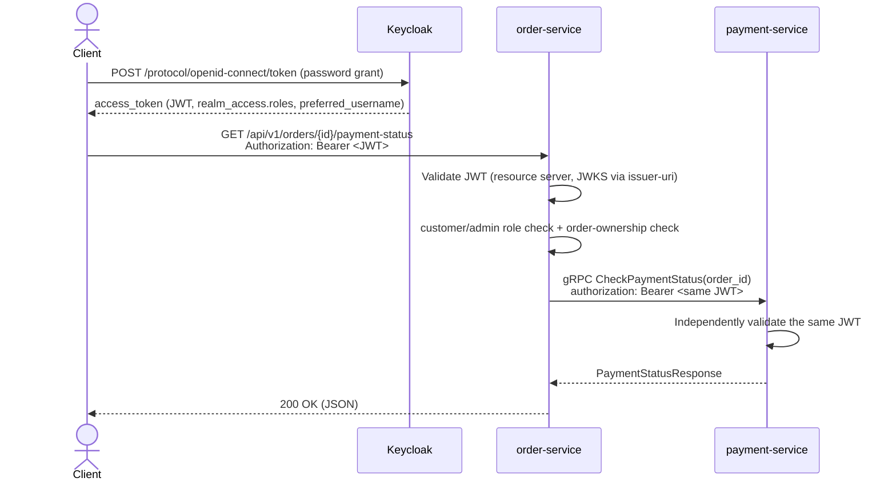

# Authentication & Authorization

Both services trust a single shared identity provider: a Keycloak realm named
`spring-grpc`. Neither service mints or self-signs tokens — order-service
validates the caller's token, then **relays that same token** onto the gRPC
call to payment-service, which independently re-validates it against the same
realm. This is a common "token relay" pattern for service-to-service calls
behind a shared IdP: each service enforces the trust boundary itself, rather
than trusting its caller blindly.

## Roles

The realm defines two realm roles:

| Role | Can do |
|---|---|
| `customer` | Check payment status for **their own** orders only |
| `admin` | Check payment status for **any** order |

A caller must hold at least one of these roles to call order-service's REST
endpoint at all; `customer` vs `admin` then determines which orders they can
see.

## Token flow



## Claims used

| Claim | Used for |
|---|---|
| `realm_access.roles` | Mapped to Spring Security authorities (`ROLE_customer`, `ROLE_admin`) by `KeycloakRealmRoleConverter` — duplicated in both services since Keycloak nests realm roles under this claim and Spring Security's default converter only reads a flat claim |
| `preferred_username` | Compared against an order's `customerId` (orders.json) to enforce that a `customer` may only view their own orders |
| `iss` / signature | Validated automatically by each service's `JwtDecoder`, built from `issuer-uri` (fetches Keycloak's JWKS and verifies the token's signature and issuer) |

## Configuration

Both services read the same property, each with the same default so
`./gradlew bootRun` works out of the box against the Keycloak container:

```yaml
spring:
  security:
    oauth2:
      resourceserver:
        jwt:
          issuer-uri: ${KEYCLOAK_ISSUER_URI:http://localhost:8081/realms/spring-grpc}
```

payment-service has no `spring-web`/`spring-boot-starter-webmvc` on its
classpath, so Spring Boot's resource-server autoconfiguration (which would
otherwise expose a `JwtDecoder` bean automatically) never activates there.
`GrpcSecurityConfig` builds one manually with the same standard
`JwtDecoders.fromIssuerLocation(...)` factory Spring Boot would have used.

Both services use Spring Boot 4.1's gRPC support
(`spring-boot-starter-grpc-server`/`-client`) — its `GrpcSecurity`
autoconfiguration picks up the same `JwtDecoder`/`JwtAuthenticationConverter`
beans the REST-side resource server would use, and enforcement is a single
annotation:

```java
@PreAuthorize("hasAnyRole('customer', 'admin')")
@Override
public void checkPaymentStatus(...) { ... }
```

on `PaymentGrpcService.checkPaymentStatus` (plus `@EnableMethodSecurity` on
`GrpcSecurityConfig`). This handles authentication *and* the "no
`Authorization` header must still be rejected" case correctly out of the box,
so there's no separate authorization-layer workaround needed here.

## Realm setup

The realm is defined at [`keycloak/realm-export.json`](../keycloak/realm-export.json)
and imported automatically when the container starts:

```bash
docker compose up keycloak
```

It contains:

- Realm roles `customer` and `admin`
- A public client `spring-grpc-app` with **direct access grants** (the OAuth2
  Resource Owner Password Credentials grant) enabled — this is what lets you
  fetch a token with a plain `curl` for local testing. **This grant type is
  for local development only**; a real frontend would use the Authorization
  Code flow with PKCE instead, and a real service-to-service client would use
  the client-credentials grant against its own dedicated client.
- Three test users: `cust-01` / `cust-02` (role `customer`, password
  `customer123`) and `admin` (role `admin`, password `admin123`). Usernames
  `cust-01` / `cust-02` intentionally match `orders.json`'s `customerId`
  values (Keycloak lowercases usernames), so those two users can each view
  their own sample orders and get `403` on each other's.

Get a token:

```bash
curl -s -X POST http://localhost:8081/realms/spring-grpc/protocol/openid-connect/token \
  -H 'Content-Type: application/x-www-form-urlencoded' \
  -d 'grant_type=password' \
  -d 'client_id=spring-grpc-app' \
  -d 'username=cust-01' \
  -d 'password=customer123' \
  | jq -r .access_token
```

## Where ownership is enforced, and why

The `customer`-may-only-view-their-own-orders check lives in
[`OrderPaymentStatusService`](../order-service/src/main/java/com/example/orderservice/service/OrderPaymentStatusService.java),
not in `WebSecurityConfig`'s request matcher, because it needs the order
record itself (to compare `order.customerId()` against the caller's
`preferred_username`) — that data only exists once the order has been looked
up. `WebSecurityConfig` only enforces the coarser "must hold `customer` or
`admin`" check, which is all the web layer has enough information to decide
on its own.

payment-service does **not** re-implement this ownership check — it has no
notion of which customer owns which order (that's `orders.json`'s domain, not
`payments.json`'s). It only re-validates that the relayed token is genuinely
Keycloak-issued and carries one of the two roles; the fine-grained decision
already happened upstream in order-service.

## HTTP status mapping

| Situation | Status |
|---|---|
| No / invalid / expired token | `401 Unauthorized` |
| Valid token, but caller lacks `customer` or `admin` | `401 Unauthorized` (rejected by the resource-server filter chain before reaching the controller) |
| `customer` token, order belongs to a different customer | `403 Forbidden` |
| Order id (or, upstream, payment record) doesn't exist | `404 Not Found` |
| payment-service rejected the relayed token (`UNAUTHENTICATED`/`PERMISSION_DENIED`) | `502 Bad Gateway` — a persistent misconfiguration (e.g. the two services pointed at different realms), not a transient failure, so it's kept distinct from the case below |
| payment-service unreachable or any other gRPC failure | `503 Service Unavailable` |

## Testing without a running Keycloak

Neither test suite depends on a real Keycloak instance:

- **order-service**'s `OrderPaymentStatusIntegrationTest` overrides the
  `JwtDecoder` bean with a symmetric-key (`HS256`) decoder and mints tokens
  locally with Nimbus JOSE JWT (already transitively on the classpath via
  `spring-security-oauth2-jose`) — no real signing key or network call needed.
- **payment-service**'s `PaymentServiceSecurityIntegrationTest` binds the gRPC
  server in-process via `spring.grpc.server.inprocess.name`, so the test runs
  through the *real*, fully-autoconfigured security beans (`GrpcSecurity` +
  `@PreAuthorize`) rather than a hand-assembled interceptor chain that could
  silently drift from production. Only `JwtDecoder.decode(...)` is mocked (via
  `@MockitoBean`); real token signature verification is Spring Security's own
  well-tested code, not ours, so it isn't what these tests are trying to
  prove.
- **order-service**'s `OrderPaymentStatusIntegrationTest` swaps in a
  `@Primary GrpcChannelFactory` test bean pointed at a plain, Spring-free
  in-process fake `payment-service`, rather than the framework's own
  `@AutoConfigureTestGrpcTransport` — that annotation's test channel factory
  doesn't apply `GrpcChannelBuilderCustomizer` beans, which would silently
  drop `JwtRelayClientInterceptor` and defeat the one thing this test most
  needs to prove (confirmed by inspecting its bytecode after it produced
  token-less `UNAUTHENTICATED` failures in practice).

Both run as part of `./gradlew build` and the GitHub Actions pipeline.
