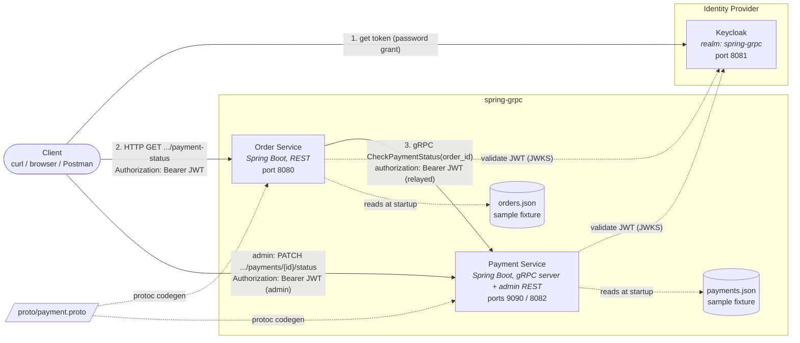

# Container Diagram

This is a C4-style **container diagram**: it shows the two deployable services in
this system, the shared proto contract that binds them, and where each service's
sample data comes from.

## Containers

| Container | Responsibility | Technology | Port |
|---|---|---|---|
| **Order Service** | Public REST API. Validates the caller's JWT and the order exists, enforces that a `customer` may only see their own orders, then delegates to Payment Service over gRPC to check payment status. | Spring Boot 4.1, Spring Web MVC, gRPC client (`spring-boot-starter-grpc-client`), OAuth2 resource server | `8080` (HTTP) |
| **Payment Service** | gRPC server: independently validates the relayed JWT (`@PreAuthorize`), then looks up (or repeatedly polls, for watches) payment records by order id. Also exposes its own admin-only REST endpoint that mutates a payment's status directly, with no connection to the gRPC side. | Spring Boot 4.1, gRPC server (`spring-boot-starter-grpc-server`), Spring Web MVC, OAuth2 resource server | `9090` (gRPC), `8082` (HTTP) |
| **Keycloak** | Shared identity provider both services trust. Issues tokens to clients and exposes the JWKS both services validate against. | Keycloak (Docker), realm `spring-grpc` | `8081` (HTTP, mapped from the container's `8080`) |

## Relationships

- **Client → Keycloak**: obtains a bearer token (see [auth.md](auth.md) for
  the full flow and how to fetch one with `curl`).
- **Client → Order Service**: synchronous REST call carrying that token, JSON
  response.
- **Order Service → Payment Service**: synchronous unary gRPC call defined in
  [`proto/payment.proto`](../proto/payment.proto), carrying the **same**
  bearer token relayed from the inbound REST request. This is the primary
  integration point between the two services — they share no database and no
  code beyond the generated stub classes and a small, duplicated
  Keycloak-claims-to-authorities converter. `payment.proto` also defines a
  second, server-streaming RPC (`WatchPaymentStatus`) that Order Service
  consumes in the background from an admin-only endpoint; those updates are
  only logged and kept in memory, not shown here since they never reach the
  client. There's no subscriber registry or push mechanism on Payment
  Service's side: the caller (Order Service) specifies how many times to
  poll, how long to wait between polls, and which status it's waiting for,
  and Payment Service just re-reads its own storage on that schedule,
  closing early once the payment's status matches the one Order Service
  asked for -- Order Service's own consuming loop stops on the same
  condition. See the root [README](../README.md) for details.
- **Client (admin) → Payment Service**: a separate, synchronous REST call
  (`PATCH /api/v1/payments/{orderId}/status`) that Order Service is not
  involved in at all — it mutates the stored payment directly and has no
  awareness of whether anything is watching. A watch only sees the change on
  its next poll, not instantly. Gated to the `admin` role only, with no
  order-ownership concept (see [auth.md](auth.md)).
- **Order Service / Payment Service → Keycloak**: both independently validate
  the token's signature against Keycloak's JWKS (via `issuer-uri`); neither
  service trusts the other's validation. See [auth.md](auth.md) for why and
  for the role/ownership rules enforced on each side.
- **proto/payment.proto → both services**: the single source of truth for the
  wire contract. See [proto-pipeline.md](proto-pipeline.md) for how it's
  compiled into each service.

## Data

Both services hold their sample data as bundled, read-only JSON fixtures
(`src/main/resources/data/*.json`) loaded into memory at startup — there is no
database in this learning project. See the root [README](../README.md) for
sample order/payment ids.
