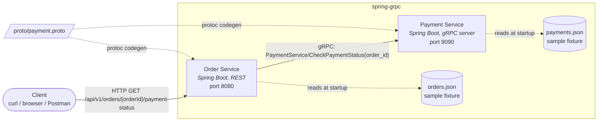

# Container Diagram

This is a C4-style **container diagram**: it shows the two deployable services in
this system, the shared proto contract that binds them, and where each service's
sample data comes from.

## Containers

| Container | Responsibility | Technology | Port |
|---|---|---|---|
| **Order Service** | Public REST API. Validates the order exists, then delegates to Payment Service over gRPC to check payment status. | Spring Boot 3, Spring Web, gRPC client (`net.devh:grpc-client-spring-boot-starter`) | `8080` (HTTP) |
| **Payment Service** | gRPC server. Looks up payment records by order id. | Spring Boot 3, gRPC server (`net.devh:grpc-server-spring-boot-starter`) | `9090` (gRPC) |

## Relationships

- **Client → Order Service**: synchronous REST call, JSON response.
- **Order Service → Payment Service**: synchronous unary gRPC call defined in
  [`proto/payment.proto`](../proto/payment.proto). This is the only integration
  point between the two services — they share no database and no code beyond
  the generated stub classes.
- **proto/payment.proto → both services**: the single source of truth for the
  wire contract. See [proto-pipeline.md](proto-pipeline.md) for how it's
  compiled into each service.

## Data

Both services hold their sample data as bundled, read-only JSON fixtures
(`src/main/resources/data/*.json`) loaded into memory at startup — there is no
database in this learning project. See the root [README](../README.md) for
sample order/payment ids.
