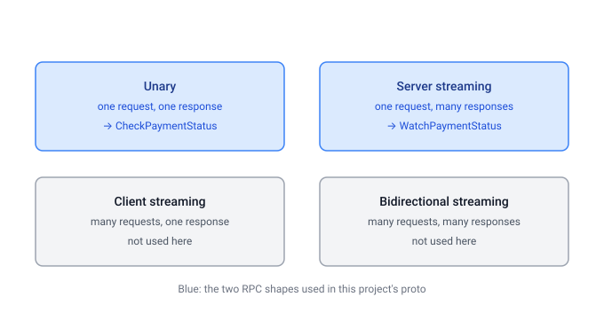
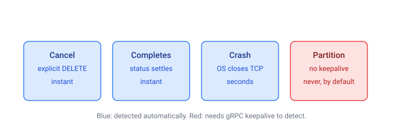
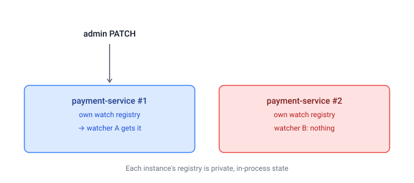

# gRPC Learnings

A short reference of gRPC concepts, constraints, and best practices, based on
building and revising the `WatchPaymentStatus` streaming feature in this
project.

## The four RPC shapes

Every gRPC RPC has a request stream and a response stream. Unary is the
special case where both streams hold exactly one message. The four "types"
are just the four combinations of single/many on each side.

This project uses unary (`CheckPaymentStatus`) and server-streaming
(`WatchPaymentStatus`). Client-streaming and bidirectional streaming weren't
needed here — order-service only ever sends one request per call.

## What a stream actually is

A server-streaming call is one HTTP/2 stream, held open, carrying a sequence
of length-prefixed messages before a trailer frame closes it and reports the
final status. There's no different mechanism for "streaming" versus "unary" —
only how many message frames get written before the trailer.

## Cancellation, crashes, and deadlines

A stream can end four ways, and only three of them are detected automatically
without extra configuration:

- **Explicit cancel**: interrupting the thread blocked in a blocking-stub
  iterator is grpc-java's documented way to cancel a call from another
  thread; the server can observe this via
  `ServerCallStreamObserver.setOnCancelHandler(...)`. This project doesn't
  use either side of that mechanism — `WatchPaymentStatus` has no external
  way to be cancelled early. Both sides independently reach the same
  conclusion instead: payment-service closes the stream once it reads a
  terminal status, and order-service's consuming loop stops on the same
  condition, without either one signaling the other.
- **Terminal completion**: the server calls `onCompleted()`.
- **Process crash**: the OS closes the TCP connection, which grpc-java
  reports as a cancellation (server side) or `UNAVAILABLE`/`UNKNOWN` (client
  side), typically within seconds.
- **Silent network partition**: without gRPC keepalive configured (`spring.grpc.server.keepalive.*`
  / `spring.grpc.client.channel.*.keepalive.*`), neither side notices a
  connection that dies without a clean TCP close. This project does not
  configure keepalive.

Deadlines are a separate concern from all of the above — they bound how long
a caller is willing to wait, regardless of why the other side might be slow.
A watch stream that's meant to stay open intentionally has none; a unary call
made from a synchronous request thread should generally have one, to avoid
that thread blocking indefinitely if the callee stalls. This project doesn't
set one on `CheckPaymentStatus` either.

## Building pub/sub on top of gRPC is not a framework feature

Neither grpc-java nor Spring gRPC (`spring-boot-starter-grpc-server`)
provides a subscriber registry, broadcast helper, or reactive stub support.
`@GrpcService` wraps a plain generated `ImplBase` and adds interceptors,
health checks, and security — nothing about fan-out to multiple open
streams. A hand-rolled `Map<key, List<StreamObserver>>`, populated by a
long-lived call and read from elsewhere, is the standard pattern for this —
confirmed against Spring's own reference docs and independent examples doing
the identical thing, not specific to this project.

Two real constraints came up when this project used that pattern
(`PaymentWatchRegistry`, since removed):

- **Thread safety**: `StreamObserver` is not documented as thread-safe.
  Calling `onNext()` from a different thread than whatever created the call
  is fine; calling it from two threads *concurrently* on the same observer is
  not. A shared registry makes that concurrent access possible unless
  callers are careful.
- **Per-instance state**: an in-memory registry lives in one JVM's heap. It
  does not coordinate across replicas.

## gRPC streaming versus a message broker

The constraints above are not reasons to avoid gRPC streaming — they're the
signal for when a broker like Kafka is the better fit instead. The
distinction:

| | gRPC streaming | Kafka |
|---|---|---|
| Delivery if nobody's listening | lost | durable, replayable from offset |
| Producer needs a live connection to each consumer | yes | no — publish and walk away |
| Multiple independent consumers | each needs its own stream; app code fans out | broker fans out via consumer groups |
| Operational cost | none beyond the services already running | a broker cluster to run and monitor |

The trigger for reaching for a broker isn't "gRPC has constraints" — every
system does. It's a specific requirement gRPC streaming cannot satisfy:
replay for a consumer that wasn't listening yet, a durable record of every
change, or multiple independent downstream services that shouldn't each
require a dedicated live connection back to the producer.

## What changed in this project, and why

`WatchPaymentStatus` went through two designs:

1. **Registry-based push**: payment-service tracked open `StreamObserver`s in
   `PaymentWatchRegistry`; its REST `PATCH` endpoint pushed new values to
   them directly. Removed because it introduced shared mutable state, a
   thread-safety gap, and a single-instance assumption, for a feature that
   didn't need live push.
2. **Caller-driven poll loop** (current): each `WatchPaymentStatus` call
   independently re-reads the payment up to `watch_count` times, waiting
   `watch_interval_seconds` between reads, and closes early on a terminal
   status. The caller (order-service) sets the schedule. There is no shared
   state between the REST write path and the gRPC read path — a `PATCH`
   becomes visible on the watch's next poll, not instantly.

The trade made was latency (up to one interval, instead of immediate) for
simplicity (no registry, no cross-thread `StreamObserver` access, no
per-instance assumption).

A manual cancel endpoint (order-service `DELETE .../watch`, backed by
interrupting the consuming thread and a matching
`setOnCancelHandler` on payment-service) was added, then removed once both
sides already stopped on their own whenever a terminal status appeared --
the explicit cancel path had no case left to handle.

## Checklist

- Reuse request/response messages across RPCs when they share the same
  shape; don't force new message types for their own sake.
- Prefix proto enum values with the enum name (e.g. `PAYMENT_STATUS_PENDING`)
  to avoid future namespace collisions — this project does not, currently.
- Set a deadline on any blocking unary call made from a request-handling
  thread.
- Configure gRPC keepalive for any stream expected to stay open for more
  than a few seconds, if silent network partitions need to be detected.
- Never call `onNext()`/`onCompleted()`/`onError()` on the same
  `StreamObserver` from more than one thread without synchronizing.
- Prefer a bounded, caller-parameterized stream over an indefinite one with
  shared server-side state, when live push isn't a hard requirement.
- Reach for a broker (Kafka or similar) when the requirement is durability,
  replay, or multiple independent consumers — not merely because a
  hand-rolled in-memory pattern has limits.
