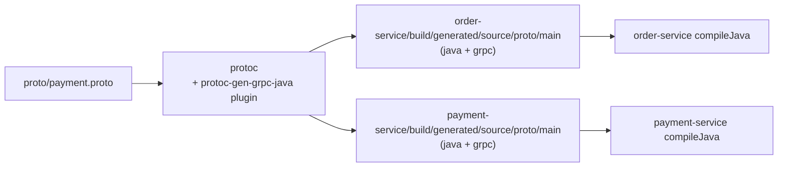

# Proto Generation Pipeline

## Why the proto file lives at the repo root

[`proto/payment.proto`](../proto/payment.proto) is kept at the repository root,
**outside** both `order-service` and `payment-service`, because it is the
contract shared by both of them. Neither service owns it; both consume it.
Keeping a single copy at the root avoids the two services' definitions
drifting out of sync, which is what would happen if each module kept its own
copy under `src/main/proto`.

```
spring-grpc/
├── proto/
│   └── payment.proto        ← single source of truth
├── order-service/            ← generates stubs from ../proto at build time
└── payment-service/          ← generates stubs from ../proto at build time
```

## How each module consumes it

Both `order-service/build.gradle.kts` and `payment-service/build.gradle.kts`
apply the [`com.google.protobuf`](https://github.com/google/protobuf-gradle-plugin)
Gradle plugin and point the `main` source set's proto directory at the root
folder:

```kotlin
sourceSets {
    main {
        proto {
            srcDir("../proto")
        }
    }
}

protobuf {
    protoc {
        artifact = "com.google.protobuf:protoc:$protobufVersion"
    }
    plugins {
        create("grpc") {
            artifact = "io.grpc:protoc-gen-grpc-java:$grpcVersion"
        }
    }
    generateProtoTasks {
        all().forEach { task -> task.plugins { create("grpc") } }
    }
}
```

Each module compiles the **same** `.proto` file independently into its own
generated sources — there is no shared "proto" jar module. This keeps the
Gradle setup simple for a two-service project; if this grew to more services,
the next step would be extracting a dedicated `proto` module that publishes
generated stubs as a library.

## Pipeline



1. **`protoc`** (the Protocol Buffers compiler) parses `payment.proto` and, via
   the `protoc-gen-grpc-java` plugin, emits:
   - Message classes (`PaymentStatusRequest`, `PaymentStatusResponse`, the
     `PaymentStatus` enum) — from `protoc` itself.
   - The gRPC service base/stub classes (`PaymentServiceGrpc`, with its
     `PaymentServiceImplBase` and `PaymentServiceBlockingStub`) — from the
     `protoc-gen-grpc-java` plugin.
2. Generated sources land under each module's
   `build/generated/source/proto/main/{java,grpc}` — these directories are
   build output, not checked into git (see `.gitignore`), and are added to
   each module's compile source set automatically by the protobuf plugin.
3. The `generateProto` task is wired as a dependency of `compileJava`, so
   generation happens transparently as part of every normal build — there is
   no separate manual step in day-to-day development.

## Regenerating manually

Generation happens automatically, but if you want to trigger it explicitly
(e.g. to inspect the generated code):

```bash
./gradlew generateProto
```

Generated code for a single module:

```bash
./gradlew :order-service:generateProto
./gradlew :payment-service:generateProto
```

## Changing the contract

1. Edit `proto/payment.proto`.
2. Run `./gradlew build` — both services regenerate and recompile against the
   new contract.
3. Follow standard protobuf compatibility rules so already-deployed clients
   don't break:
   - Never reuse or renumber an existing field number.
   - Add new fields as new, unused numbers — don't repurpose old ones.
   - Prefer marking removed fields `reserved` over deleting them outright.
   - Adding a new RPC or a new enum value is backward compatible; removing one
     is not.
